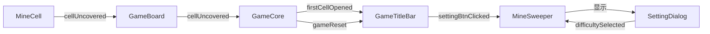

# 扫雷游戏项目文档（基于实际代码）

## 项目概述

这是一个基于Qt框架开发的扫雷游戏，实现了经典Windows扫雷游戏的核心功能，包括游戏逻辑、界面交互和难度选择等特性。项目采用模块化设计，代码结构清晰，便于维护和扩展。

## 项目结构树（实际代码结构）

```
MineSweeper/
├── CMakeLists.txt                    # CMake构建配置文件
├── main.cpp                          # 程序入口点
├── minesweeper.h                     # 主窗口类声明
├── minesweeper.cpp                   # 主窗口类实现
├── minesweeper.ui                    # 主窗口UI文件
├── gamecore.h                        # 游戏核心逻辑类声明
├── gamecore.cpp                      # 游戏核心逻辑类实现
├── gameboard.h                       # 游戏棋盘类声明
├── gameboard.cpp                     # 游戏棋盘类实现
├── gameconfig.h                      # 游戏配置类声明
├── gameconfig.cpp                    # 游戏配置类实现
├── gametitlebar.h                    # 游戏标题栏类声明
├── gametitlebar.cpp                  # 游戏标题栏类实现
├── minecell.h                        # 地雷格子类声明（包含CellState枚举）
├── minecell.cpp                      # 地雷格子类实现
├── minecell.ui                       # 地雷格子UI文件
├── settingdialog.h                   # 设置对话框类声明
├── settingdialog.cpp                 # 设置对话框类实现
└── resources/                        # 资源文件目录
    ├── res/
    │   ├── num1.png ~ num8.png      # 数字图片（1-8）
    │   ├── redflag.png              # 红旗标记图标
    │   ├── quemark.png              # 问号标记图标
    │   └── mine.png                 # 地雷图标
    └── resources.qrc                # Qt资源文件
```

## 项目架构设计

### 1. 模块化设计

项目采用分层模块化设计，每个类职责清晰：

- **配置层**：`GameConfig` - 全局配置管理
- **视图层**：`MineSweeper`、`GameTitleBar`、`SettingDialog` - 界面展示
- **控制层**：`GameCore` - 游戏逻辑控制
- **模型层**：`GameBoard`、`MineCell` - 数据模型和游戏元素

### 2. 核心模块详细分析

#### 2.1 游戏配置模块 (GameConfig)

**设计理念**：
采用单例模式变体（静态类），集中管理所有游戏常量，避免重复定义和硬编码。

**关键特性**：
```cpp
// 统一管理游戏难度参数
static void setDifficulty(Difficulty diff);
static int rowCount();
static int colCount();
static int mineCount();

// 提供便捷的坐标验证
static bool isPosValid(int row, int col);
static bool isPosValid(const QPoint& pos);
```

**三种预设难度**：
- 初级：9×9，10个地雷
- 中级：16×16，40个地雷（默认）
- 高级：16×30，99个地雷

#### 2.2 主窗口模块 (MineSweeper)

**职责**：
- 应用程序主窗口
- 协调各个模块的初始化和连接
- 处理游戏难度切换

**关键流程**：
```cpp
// 初始化流程
SweeperInit() → 创建GameTitleBar → 创建GameCore → 连接信号槽

// 难度切换流程
onDifficultySelected() → 更新GameConfig → 重置游戏面板
```

#### 2.3 游戏核心模块 (GameCore)

**职责**：
- 游戏状态管理
- 处理玩家操作逻辑
- 实现游戏规则（翻开、标记、批量翻开）

**核心状态变量**：
```cpp
bool first_hit_m;     // 标记是否为第一次点击
int opencnt;          // 已翻开的安全格子计数
```

**关键算法**：
1. **首次点击保护**：确保第一次点击不会是地雷
2. **洪水填充算法**：递归翻开空白区域
3. **批量翻开逻辑**：实现扫雷的双击操作

#### 2.4 游戏棋盘模块 (GameBoard)

**职责**：
- 管理所有地雷格子的布局
- 地雷位置生成和状态管理
- 作为MineCell的容器和控制器

**数据结构**：
```cpp
QVector<QVector<MineCell*>> BoardVector_m;  // 二维数组存储格子
QSet<QPoint> mine_posision_m;               // 地雷位置集合
```

**地雷生成算法特点**：
- 避开第一次点击位置周围2格区域
- 有最大重试次数保护，避免无限循环
- 生成失败时自动调整地雷数量

#### 2.5 地雷格子模块 (MineCell)

**设计特点**：
继承自QPushButton，实现自定义交互逻辑。

**状态机**：
```
COVERED (未翻开)
    ↓ 左键
UNCOVERED (已翻开)
    ↓ 右键
FLAGGED (标记红旗)
    ↓ 右键
QUESTIONED (标记问号)
    ↓ 右键
COVERED (循环)
```

**鼠标事件处理**：
```cpp
void mousePressEvent(QMouseEvent *e) {
    if (右键 && 左键已按下) {
        // 批量翻开操作
        emit chordOpenRequest(posision_m);
    }
    else if (右键) {
        // 标记循环：未翻开→红旗→问号→未翻开
    }
    else if (左键) {
        // 翻开格子
        emit cellUncovered(posision_m);
    }
}
```

#### 2.6 标题栏模块 (GameTitleBar)

**功能**：
- 显示游戏标题和当前难度
- 计时器功能（开始、暂停、重置）
- 设置按钮入口

**UI设计特点**：
- 使用渐变背景和圆角设计
- 计时器使用等宽字体显示
- 按钮悬停效果

#### 2.7 设置对话框模块 (SettingDialog)

**功能**：
- 提供难度选择界面
- 显示每个难度的详细参数
- 通过信号机制与主窗口通信

### 3. 信号槽通信机制

项目大量使用Qt的信号槽机制实现模块间解耦：



### 4. 关键算法实现细节

#### 4.1 地雷生成算法

```cpp
void GameBoard::MinePosisionInit(QPoint point) {
    // 避开第一次点击周围区域
    while(地雷数不足 && 重试次数未超限) {
        随机生成位置p;
        if(p在point周围2格内) continue;
        if(位置已有地雷) continue;
        添加到地雷集合;
    }
    
    // 异常处理
    if (地雷数不足) {
        qWarning() << "地雷生成失败，自动调整地雷数";
    }
}
```

#### 4.2 洪水填充算法

```cpp
void GameCore::FloodFill(QPoint p) {
    翻开当前格子p;
    opencnt++;
    
    if (当前格子数字为0) {
        for (每个相邻格子) {
            if (格子未翻开) {
                FloodFill(相邻格子); // 递归展开
            }
        }
    }
}
```

#### 4.3 批量翻开算法

```cpp
void GameCore::processChordOpen(QPoint pos) {
    // 检查周围红旗数是否等于格子数字
    int 红旗数 = countSurroundFlag(pos);
    int 格子数字 = 获取格子数字(pos);
    
    if (红旗数 == 格子数字) {
        openSurroundCells(pos); // 翻开周围符合条件的格子
    }
}
```

### 5. 游戏流程

#### 5.1 正常游戏流程
1. 玩家选择难度（默认中级）
2. 点击任意格子开始游戏
3. 计时器启动
4. 左键翻开格子，右键标记地雷
5. 双击已翻开的数字格子可批量翻开周围
6. 翻开所有安全格子 → 游戏胜利
7. 踩到地雷 → 游戏失败

#### 5.2 胜利条件
```cpp
// 当已翻开的格子数 >= 安全格子数时胜利
if(opencnt >= GameConfig::safeCellCount()) {
    emit gameWin(); // 触发胜利弹窗
}
```

### 6. UI/UX设计特点

#### 6.1 视觉反馈
- **数字颜色**：不同数字使用不同颜色（通过图片资源实现）
- **状态变化**：格子在不同状态下有明显视觉差异
- **计时器**：使用蓝色突出显示，格式为MM:SS

#### 6.2 交互设计
- **首次点击保护**：提升游戏体验
- **右键循环标记**：符合扫雷传统操作习惯
- **批量翻开**：提高游戏效率

#### 6.3 响应式设计
- 窗口大小根据难度动态调整
- 标题栏和棋盘位置自动计算

### 7. 代码质量特点

#### 7.1 可维护性
- 配置集中管理，便于修改
- 模块职责分离，耦合度低
- 使用const和inline优化性能

#### 7.2 健壮性
- 边界检查完善（如CheckOut函数）
- 异常处理（地雷生成失败处理）
- 内存管理规范（析构函数释放资源）

#### 7.3 可扩展性
- 通过GameConfig轻松添加新难度
- 信号槽机制便于添加新功能
- 模块化设计支持功能扩展

### 8. 编译与运行

#### 8.1 环境要求
- Qt 5.15+ 或 Qt 6.0+
- C++17兼容编译器
- CMake 3.16+

#### 8.2 构建步骤
```bash
mkdir build && cd build
cmake .. -DCMAKE_PREFIX_PATH=/path/to/Qt
make -j4
./MineSweeper
```

#### 8.3 跨平台支持
- 支持Windows、macOS、Linux
- 自动处理不同平台的特性
- 支持Android构建（需配置）

### 9. 未来扩展方向

#### 9.1 功能增强
1. **自定义难度**：允许玩家自定义行列数和地雷数
2. **主题系统**：支持更换格子样式和颜色方案
3. **音效系统**：添加点击、胜利、失败等音效

#### 9.2 游戏特性
1. **撤销功能**：允许撤销上一步操作
2. **提示系统**：在玩家卡住时提供提示
3. **保存/加载**：支持游戏进度保存

#### 9.3 社区功能
1. **排行榜**：记录最快通关时间
2. **成就系统**：解锁各种游戏成就
3. **回放功能**：记录并回放游戏过程

### 10. 总结

本项目实现了完整的扫雷游戏功能，具有以下优点：

1. **架构清晰**：采用分层模块化设计，代码结构清晰
2. **功能完整**：实现了扫雷的所有核心功能和交互
3. **用户体验好**：界面美观，操作流畅，符合用户习惯
4. **代码质量高**：注释完善，错误处理全面，易于维护
5. **扩展性强**：通过良好的设计支持未来功能扩展

项目成功地复现了经典Windows扫雷的游戏体验，同时通过现代C++和Qt框架的应用，展示了良好的软件工程实践。
